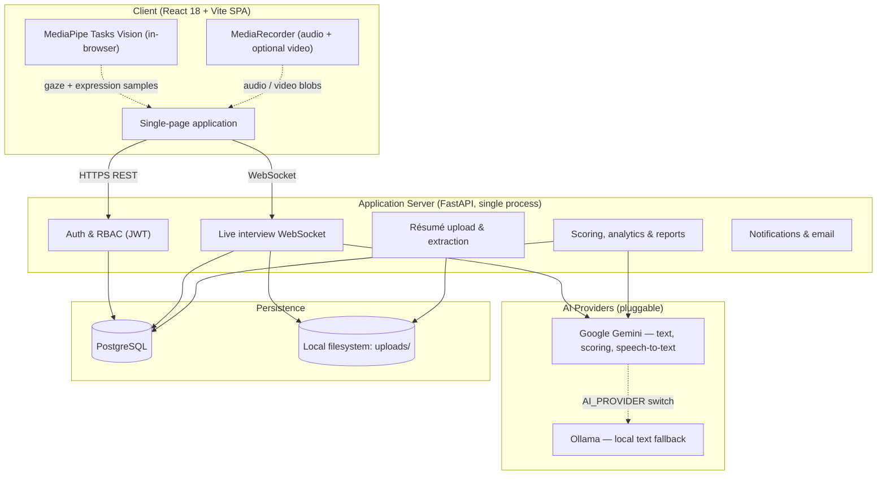
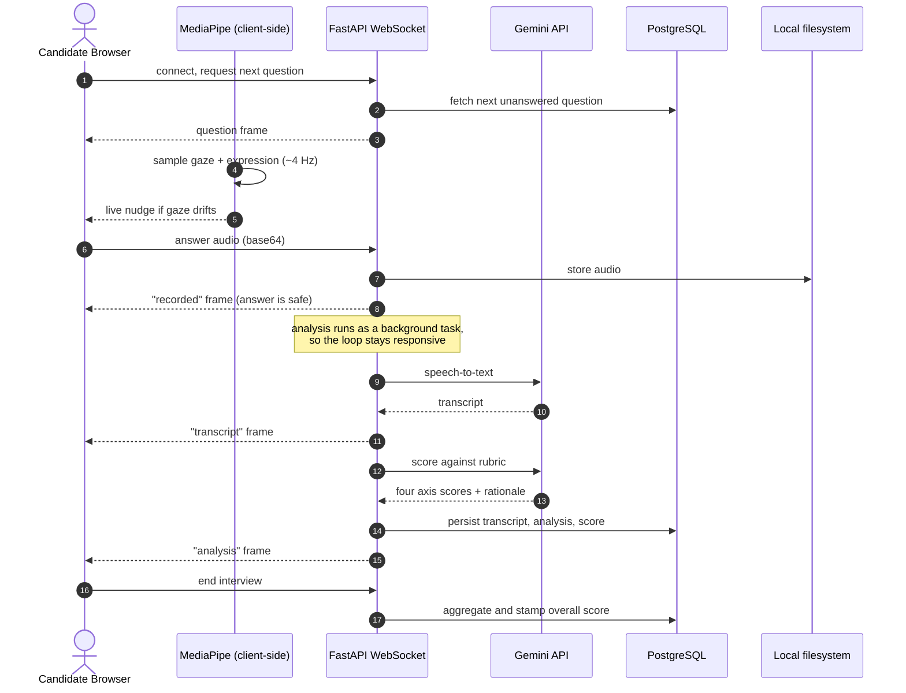
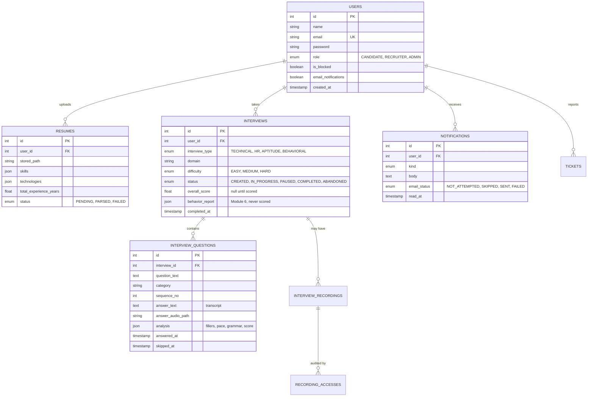

# SmartHire AI: AI-Powered Mock Interview & Candidate Assessment Platform
**Software Architecture Document & Project Report**

---

## 1. Author Details & Declarations

### 1.1 Author
* **Name:** Divyesh Kumar Pamarthy

### 1.2 AI / LLM Usage Declaration
* **Assisting technologies:** Google Gemini (question generation, résumé extraction, speech-to-text, answer scoring) as a runtime dependency of the product; LLM assistance during development for drafting prompt templates, scoring rubric wording, and documentation.
* **Runtime vs. development use.** These are separate and worth distinguishing. The platform *itself* calls Gemini at runtime — that is a product feature, not an authoring aid. Separately, LLM assistance was used while writing the system.
* **Extent of development assistance:** Roughly 10–15%, concentrated in prompt templates, rubric phrasing and documentation. Architecture, the scoring pipeline, the browser-side computer vision integration, and the full-stack implementation were designed and written directly.

---

## 2. Executive Summary & Problem Statement

### 2.1 Executive Summary
**SmartHire AI** is a multimodal mock interview and automated candidate assessment platform. It combines browser-side computer vision, cloud speech-to-text, LLM-assisted answer scoring, and aggregate analytics into a single practice environment.

Candidates take technical, behavioural, aptitude or HR interviews. The system records spoken answers, transcribes them, and scores each answer against a fixed, disclosed four-axis rubric. Separately, and deliberately kept out of the score, it measures on-camera engagement in the candidate's own browser. Results are presented as a per-interview report and as a history-level view of skills, trends and weak areas, with practice recommendations attached.

A design commitment runs through the whole system and is stated here because it constrains several sections below: **the platform reports what it measured, and declines to report what it cannot measure honestly.** Several features are deliberately weaker than they could be for this reason.

### 2.2 Problem Statement
1. **Preparation asymmetry.** Candidates lack realistic practice environments that give objective, itemised feedback before a high-stakes interview.
2. **Feedback opacity.** Commercial screening platforms are built for the employer. The candidate typically receives a decision and no explanation.
3. **Siloed evaluation.** Existing tools separate what was said from how it was delivered, leaving candidates to guess at the part they cannot self-observe.

---

## 3. System Architecture & Technology Stack

### 3.1 High-Level Architecture

**Deliberately absent.** There is no message broker, no worker fleet and no object store. Background work — transcription and scoring after an answer is submitted — runs as an `asyncio` task inside the same process, and uploaded files are written to the local filesystem. This is honest about the scale the system was built for. Introducing Celery, Redis or S3 would be the right move at multi-tenant scale and would be a genuine change, not a configuration flag.

### 3.2 Live Interview Sequence

Two details in that flow are design decisions rather than implementation accidents:

**The `recorded` frame is sent before transcription begins.** The recording is the primary artefact. A transcription outage, a spent quota or a slow model must never cost the candidate their answer.

**Analysis runs as a background task, not inline.** An earlier version awaited it inside the receive loop, which meant the server could not read another message until scoring finished — "Next question" appeared enabled, did nothing, and read as a broken button.

### 3.3 Technology Stack

| Layer | Chosen | Rationale |
| :--- | :--- | :--- |
| **Frontend** | React 18 + Vite | Mature handling of `MediaStream`, `MediaRecorder` and WebSocket state. |
| **Styling** | Single hand-written stylesheet (CSS custom properties) | No utility framework or animation library. One stylesheet, one set of design tokens, no build-time CSS pipeline to maintain. |
| **Backend** | Python 3.12 + FastAPI | Native interoperability with the AI client libraries; first-class async and WebSocket support. |
| **Database** | PostgreSQL via SQLAlchemy | Relational integrity across users, interviews and questions, plus JSON columns for per-answer analysis whose shape evolves. |
| **Background work** | `asyncio.create_task` in-process | Sufficient for per-answer analysis at this scale. A broker would be the correct answer at higher concurrency. |
| **Computer vision** | MediaPipe Tasks Vision, in-browser (WASM) | Gaze and expression are computed on the candidate's own machine. Only a small numeric summary is uploaded. |
| **Speech-to-text** | Google Gemini | Chosen for native audio understanding. Note the constraint: no local alternative exists, so transcription stops when the quota is spent. |
| **Text AI** | Gemini, with Ollama as a local fallback | Selected by the `AI_PROVIDER` setting. Ollama has no speech models, so speech always routes to Gemini regardless. |
| **Auth** | JWT (`python-jose`) + `passlib`/bcrypt | Stateless tokens; role claims drive the RBAC dependency on each route. |
| **Deployment** | Docker + Render | A persistent process is required — WebSockets are held open for the length of an interview, which rules out serverless. |

---

## 4. Database Architecture & Data Model

### 4.1 Entity-Relationship Diagram

### 4.2 Schema Notes

**Integer primary keys, not UUIDs.** A deliberate simplification for a single-tenant deployment. UUIDs would be the right choice if identifiers were ever exposed across tenants or merged between databases.

**`answered_at` and `skipped_at` are separate columns.** "Ran out of time" and "chose not to answer" are different facts about a candidate and must not be merged. Scoring treats a skipped question as *not attempted* rather than as a zero — averaging in a zero would punish ending an interview early exactly as hard as answering everything badly.

**`analysis` is a JSON column.** Its shape has changed repeatedly as the assessment pipeline evolved. A relational decomposition would have meant a migration for each change, for data that is only ever read as a whole.

**`overall_score` is nullable, and null means "not scored".** This is distinct from zero. A quota failure leaves the recording intact and the score absent, and every surface reports that distinction rather than showing a zero.

**No migration framework.** Schema is created by `Base.metadata.create_all`, which builds missing tables but never alters existing ones. Each column added after the fact ships with a committed, idempotent script in `backend/scripts/`. This is a known limitation: Alembic would be the correct answer, and the scripts are the honest workaround.

---

## 5. API Specification

All routes are served under `/api`. Role enforcement is a FastAPI dependency on each route.

### 5.1 Authentication (`/api/auth`)

| Endpoint | Method | Access | Purpose |
| :--- | :--- | :--- | :--- |
| `/auth/register` | `POST` | Public | Create an account with a role. |
| `/auth/login` | `POST` | Public | Issue a JWT access token. |
| `/auth/me` | `GET` | Bearer | Resolve the current user and role. |

### 5.2 Interviews (`/api/interviews`)

| Endpoint | Method | Access | Purpose |
| :--- | :--- | :--- | :--- |
| `/interviews/generate` | `POST` | Candidate | Generate a question set by type, domain and difficulty. |
| `/interviews/{id}/analysis` | `GET` | Owner | Per-question transcript, measurements, scores, plus the behaviour report. |
| `/interviews/{id}/recording` | `POST`/`GET` | Owner | Upload and retrieve the session video. |
| `/interviews/{id}/behavior` | `POST` | Owner | Submit aggregated browser-side gaze/expression samples. |
| `/interviews/{id}/answer-audio/{n}` | `GET` | Owner | Retrieve one answer's stored audio. |

### 5.3 Live Interview WebSocket

* **Endpoint:** `/api/voice/{interview_id}` (token-authenticated)
* **Client → server:** `next`, `answer` (base64 audio), `skip`, `pause`, `resume`, `end`
* **Server → client:** `ready`, `question`, `recorded`, `transcript`, `analysis`, `skipped`, `complete`, `closed`, `error`

`transcript` and `analysis` are produced by a background task and are therefore **not ordered** against the rest of the protocol: the candidate may request the next question while the previous answer is still being transcribed. Both frames carry a `sequence_no` for exactly this reason, and a client must match on it rather than assume the newest frame describes the question on screen.

### 5.4 Analytics (`/api/analytics`)

| Endpoint | Method | Access | Purpose |
| :--- | :--- | :--- | :--- |
| `/analytics/candidate` | `GET` | Candidate | Own activity counts and latest score. |
| `/analytics/candidate/performance` | `GET` | Candidate | Skills by category, score trend, weak areas, axis progress. |
| `/analytics/recruiter/candidates` | `GET` | Recruiter | Candidate directory ordered by activity. |
| `/analytics/recruiter/candidates/{id}/performance` | `GET` | Recruiter | One candidate's analytics, **filtered** for the role. |
| `/analytics/recruiter/compare` | `GET` | Recruiter | Two to four candidates on the same axes. Unsortable by design. |
| `/analytics/recruiter/shortlist-insights` | `GET` | Recruiter | Rule-based insights, each carrying its evidence. |
| `/analytics/leaderboard` | `GET` | Recruiter/Admin | Candidates ranked by most recent scored interview. |
| `/analytics/admin` | `GET` | Admin | Platform-wide counts and 14-day activity. |
| `/analytics/admin/ai` | `GET` | Admin | AI provider call history, failures and quota events. |

### 5.5 Notifications & Reports (`/api/notifications`)

| Endpoint | Method | Access | Purpose |
| :--- | :--- | :--- | :--- |
| `/notifications` | `GET` | Bearer | In-app notification feed. |
| `/notifications/reminders/run` | `POST` | Candidate | Raise reminders for unfinished interviews. |
| `/notifications/reports/interview/{id}.pdf` | `GET` | Owner | One interview's report as a PDF. |
| `/notifications/reports/history.pdf` | `GET` | Owner | The candidate's whole scored history as one PDF. |

---

## 6. Assessment Methodology

### 6.1 Composite Score

Each answer is scored on four axes by the AI provider against a fixed, disclosed rubric, and the interview's score is the weighted mean over answers that were actually graded:

$$S_{\text{overall}} = 0.30\,S_{\text{comm}} + 0.25\,S_{\text{conf}} + 0.30\,S_{\text{tech}} + 0.15\,S_{\text{prof}}$$

with each $S_i \in [0, 100]$.

| Axis | Weight | What it assesses |
| :--- | :---: | :--- |
| Communication | 30% | Clarity, structure, conciseness, grammar |
| Confidence | 25% | Hedging language, hesitation, assertion — **from the transcript** |
| Technical relevance | 30% | Domain accuracy, depth, completeness |
| Professionalism | 15% | Tone, etiquette, time management |

| Score | Rating |
| :--- | :--- |
| 90–100 | Excellent |
| 75–89 | Good |
| 60–74 | Average |
| 40–59 | Needs Improvement |
| 0–39 | Poor |

### 6.2 Measured Versus Assessed

The distinction matters and is surfaced in the product, not just here.

**Measured** — computed arithmetically from the transcript and recording, and reproducible: filler-word counts, speaking pace in words per minute, answer duration, gaze percentages, engagement.

**Assessed** — produced by a language model against a prompt: the four axis scores, grammar observations, clarity and structure notes, pronunciation impressions.

Every report labels which is which. Pronunciation deliberately carries **no score at all** — scoring pronunciation properly requires phoneme-level alignment the platform does not perform, so it produces listening notes and says so.

### 6.3 The Camera Data Is Never Scored

Module 6 measures eye contact, gaze direction and expression in the candidate's browser. **None of it contributes to `overall_score` or to the leaderboard**, and the exclusion is enforced by structural tests rather than left to convention.

Three reasons:

1. **It is client-supplied and therefore forgeable.** The browser uploads a numeric summary. Ranking people on a number they could fabricate would be indefensible.
2. **It is uncalibrated.** Gaze estimation without a calibration step is good enough for "spent much of this session looking down" and not good enough to be a percentage that decides anything.
3. **Eye-contact norms vary by culture and by neurodivergence.** Penalising a candidate for them would encode a bias, not measure a skill.

It is shown to the candidate as self-coaching, and a filtered subset reaches a recruiter as context beside a single interview — never as an input to anything that ranks.

### 6.4 Thin Evidence Stays Visibly Thin

A skill category with fewer than three graded answers is shown with its answer count and flagged provisional. On a candidate's own dashboard that is a courtesy. In the recruiter comparison view it is a **fairness requirement**: side by side, a figure drawn from one answer must never read as equivalent to one drawn from twelve.

Trend direction is likewise withheld below four scored interviews. Two points are two points, not a trajectory.

---

## 7. Engineering Characteristics

### 7.1 Measured Properties

No synthetic benchmark suite was run, so this section reports what the system does and what was observed, rather than figures that would imply a load-testing programme that did not happen.

| Property | Observed / designed behaviour |
| :--- | :--- |
| **Browser-side CV sampling** | ~4 Hz against the existing preview element; raw landmarks are never stored or uploaded. |
| **Video egress** | None for analysis. Only a small numeric summary is uploaded, so gaze tracking costs effectively no bandwidth. |
| **Answer acknowledgement** | Immediate — the `recorded` frame precedes transcription, so the candidate is never blocked on a model call. |
| **Transcription latency** | Seconds, dominated by the Gemini call; measured live at roughly 5.6 s average per provider call under test load. |
| **Test suite** | 512 automated backend tests across 23 files, covering scoring arithmetic, failure modes, visibility rules and endpoint behaviour. |
| **Codebase size** | ~10,900 lines of Python, ~6,700 lines of JSX. |
| **Concurrency model** | Single process, single worker. In-memory counters make horizontal scaling a change rather than a setting. |

### 7.2 Known Scaling Limits

Stated rather than omitted:

* **Single instance only.** Request and AI-call metrics live in process memory; a second worker would split the admin dashboard's view of the platform rather than share it.
* **In-process background work.** Analysis tasks do not survive a restart.
* **Local filesystem storage.** Uploads are not shared between instances and need a persistent volume or object store before scaling out.
* **Speech has no local fallback.** Ollama covers text generation offline; transcription is Gemini-only, so a spent quota stops it.

---

## 8. Competitive Positioning

| Vector | SmartHire AI | Asynchronous video screeners | Peer mock platforms |
| :--- | :--- | :--- | :--- |
| **Primary user** | The candidate | The employer | The candidate |
| **Feedback to candidate** | Full rubric breakdown, transcript, practice recommendations | Typically none | Subjective peer opinion |
| **Interview modality** | Interactive, voice, generated questions | Pre-recorded prompts | Live human |
| **Behavioural signal** | In-browser, candidate-facing, **never scored** | Server-side, often opaque, may influence outcomes | None |
| **Score transparency** | Weights disclosed; every number labelled measured or assessed | Proprietary | N/A |
| **Biometric handling** | Gaze computed on-device; only a numeric summary leaves the browser | Raw video retained server-side | N/A |

### 8.1 Differentiators

1. **The candidate is the user.** The rubric, its weights and the reasoning behind each score are shown to the person being assessed.
2. **Refusal to overclaim.** Pronunciation has no score. Camera data never ranks anyone. Thin evidence is labelled. A trend needs four interviews. Each of these makes the product look less capable and keeps it honest.
3. **On-device behavioural analysis.** Gaze and expression never leave the browser as imagery.

---

## 9. Security, Privacy & Ethics

### 9.1 What Is and Is Not Stored

Stated precisely, because the distinction is easy to blur:

* **Gaze and expression analysis never leaves the browser.** MediaPipe runs client-side; raw frames are analysed in memory and discarded. Only an aggregate summary — percentages and counts — is uploaded. Per-sample gaze logs are aggregated on arrival and **not** retained.
* **The session video, when the candidate enables the camera, *is* uploaded and stored.** This is separate from the analysis path above and is stated plainly on screen before and during recording. Only the candidate can play it back, and every access is written to an audit table.
* **Answer audio is stored** so a candidate can replay their own answers.
* **There is no automatic deletion schedule.** Files persist until removed. On the current free-tier deployment they are instead lost on every restart — a consequence of infrastructure, not a retention policy.

The camera is optional and off by default. No camera means no behaviour report, exactly as no microphone means no transcript; neither blocks an interview.

### 9.2 Bias Mitigation

* **Scoring reads the transcript, not the person.** The four axes are assessed from what was said.
* **Camera data is structurally excluded from scoring**, for the reasons in §6.3.
* **Every score carries a rationale**, so a candidate can see what produced it.
* **Uncertainty travels with the figure.** Sample sizes, provisional flags and method notes are attached to the numbers, not relegated to a footnote.

### 9.3 Access Control

| Resource / Action | Candidate | Recruiter | Admin |
| :--- | :---: | :---: | :---: |
| Upload own résumé, take interviews | **ALLOW** | DENY | DENY |
| View own reports, transcripts, recordings | **ALLOW** | DENY | DENY |
| View another candidate's transcript or recording | DENY | **DENY** | DENY |
| View candidate scores, skills and trends | own only | **ALLOW** (filtered) | **ALLOW** |
| View candidate practice recommendations | own only | **DENY** | DENY |
| Compare candidates, shortlist insights | DENY | **ALLOW** | **ALLOW** |
| Block users, change roles | DENY | DENY | **ALLOW** |
| View AI provider monitoring | DENY | DENY | **ALLOW** |

Two rows are decisions rather than defaults. **Recruiters cannot read transcripts or recordings** — they see scores and derived analytics, not the candidate's words or face. And **practice recommendations are withheld from recruiters**: that text is coaching addressed to the candidate, and a recruiter reading someone's personal remediation plan converts self-improvement advice into a mark against them. The weakness itself is still shown as a number, because a number carries its own uncertainty in a way a prescription does not.

---

## 10. Implementation Milestones & Future Scope

### 10.1 Delivery Milestones

* **Milestone 1 — Foundations.** Requirements, PostgreSQL schema, JWT authentication and role-based access control.
* **Milestone 2 — Résumé parsing & question generation.** PDF ingestion and extraction; AI-generated question sets by type, domain and difficulty, with a built-in question bank as fallback when no provider is reachable.
* **Milestone 3 — Live interview.** WebSocket session protocol, audio capture and storage, pause/resume, per-question timing.
* **Milestone 4 — Speech analysis & scoring.** Transcription, filler and pace measurement, grammar and communication assessment, the four-axis rubric and the leaderboard.
* **Milestone 5 — Behavioural tracking.** In-browser MediaPipe gaze and expression sampling with per-session calibration, live nudges, and an end-of-session report kept structurally separate from scoring.
* **Milestone 6 — Feedback & reporting.** Practice recommendations keyed to the weakest axis, downloadable PDF reports.
* **Milestone 7 — Dashboards & analytics.** Skill breakdowns, performance trends, weak-area identification, recruiter comparison and shortlisting insights, admin AI monitoring.
* **Milestone 8 — Notifications & deployment.** In-app notifications and email, reminders, containerisation and cloud deployment.

### 10.2 Future Scope

1. **Move background work out of process.** A broker and worker fleet would let analysis survive restarts and the service scale horizontally.
2. **Object storage for uploads**, removing the dependency on a single machine's filesystem.
3. **A migration framework.** Alembic in place of hand-written column scripts.
4. **Shared metrics storage**, so AI and request monitoring survive a restart and aggregate across instances.
5. **Live collaborative code sandbox** for technical rounds with real execution.
6. **Full-duplex conversational agent**, replacing turn-based recording with a real-time voice interviewer.
7. **Calibrated gaze estimation.** If accuracy ever justified it, the current uncalibrated estimate could become a figure worth more than coaching — though the decision to keep it out of scoring would need revisiting on its own merits, not automatically.

---

## 11. Demonstration

* **Repository:** the full source, including the deployment blueprint and checklist.
* **Deployment:** containerised backend and static frontend on Render, with managed PostgreSQL.
* **Demonstrated capabilities:** registration and role-based sign-in; résumé upload and extraction; a live voice interview with in-browser gaze feedback; transcription, four-axis scoring and a rubric breakdown; candidate skill and trend analytics; recruiter comparison and shortlisting insights; admin user management and AI monitoring; downloadable PDF reports.

### 11.1 Honest Limitations

Recorded because a report that lists only successes is less useful than one that says where the edges are:

* **Free-tier deployment loses uploaded files on every restart**, and its database has a fixed lifetime. Scores and transcripts survive a restart; recordings do not.
* **Gemini's free tier allows 20 requests per day.** One eight-question interview consumes nearly half of it, after which interviews are recorded but not scored.
* **No frontend test suite.** The repository has no frontend test harness; UI behaviour was verified by scripted browser walkthroughs, which is verification but not regression protection.
* **Gaze calibration was tuned on two recordings of one person.** A different face, camera height or room is unproven.
* **Email has never been sent from this codebase.** The skip and failure paths are tested against a fake transport; the first real send is unproven.

---

### End of Report
*Prepared by Divyesh Kumar Pamarthy.*
